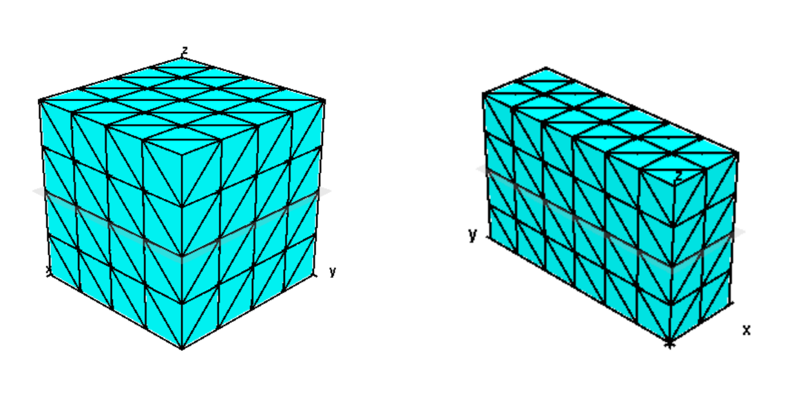
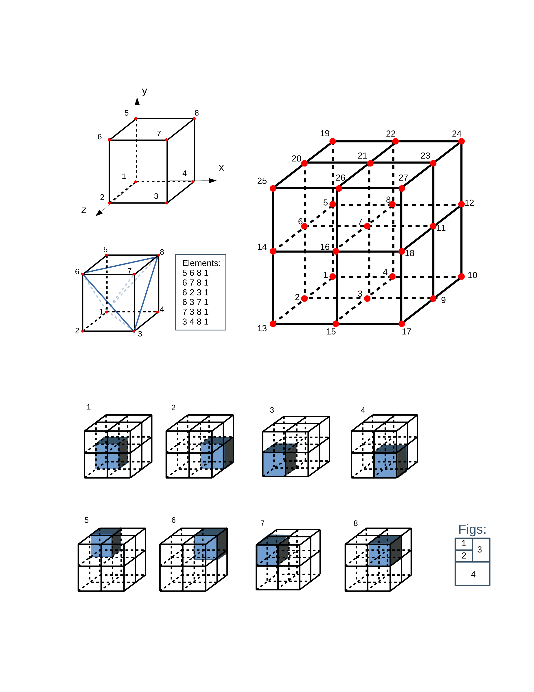

## cubeGen

### Introduction

- [cubeGen](https://github.com/birepeople/cubeGen) is a cubic structured grid generator
- follows the [tetgen](http://www.wias-berlin.de/software/index.jsp?id=TetGen&lang=1)’ s format of ‘.node’, ‘.ele’, ‘.face’ which can be visualized by [tetview](http://wias-berlin.de/software/tetgen/tetview.html)

- for faces boundary, adding ‘.top’, ‘.down’, ‘.left’, ‘.right’, ‘.front’, ‘.back’ files

### Manuel

- Use the arguments : ./cubeGen <Your path> xN zN yN [optional] -s x_scale z_scale y_scale [optional] -m x_movement z_movement y_movement

  - <Your path> a exist directory
  - {x, y, z}_N : dimensions in order x, z, y
  - {x, y, z}_scale : scale factor in order x, z, y
  - {x, y, z}_movement : movement factor in order x, z, y 

  | arguments |   description   | property  | default | factor |    range    |     type      |
  | :-------: | :-------------: | :-------: | :-----: | :----: | :---------: | :-----------: |
  |   path    | exist directory | necessary |    x    |   x    |      x      |    string     |
  |    _N     |    dimension    | necessary |    x    |   x    |  (0, 200)   |    integer    |
  |  _scale   |  scale factor   | optional  | [1 1 1] |   -s   |     >=0     | integer/float |
  | _movement | movement factor | optional  | [0 0 0] |   -m   | int32 range | integer/float |

  

- example :

  -  the left cube follows arguments  ‘./cubeGen <Your path> 4 4 4 ’
  - the right cube follows arguments ‘./cubeGen <Your path> 2 4 6 ‘
  - theses cube can also use : ‘./cubeGen <Your path> x z y -s 1 1 1 -m 0 0 0 ‘ , either ‘-s 1 1 1 ‘ or ‘ -m 0 0 0 ’  is omissible. 

### Algorithmic details

- The coordinate system: cubGen use viewport coordinates shows in **figure 1** .
- A single cube vertexs distribution : shown on **figure 1** .
- Elements - vertex mapping : shown on **figure 2** .
- cubeGen order the cubes in ‘ x - z - y ’ order, which means that in a viewport coordinate, cubes are heaped up by length, width, height direction. **Figure 4** show the heaping up procedure.
- Vertex order : Due to the heaping up order, the vertex are growing follow these order too. For inner cube, only one vertex is adding up when heaped up, like cube 8 (**Figure 4.8**) and the adding up vertex 27. For the extra vertex caused by boundary effect, the vertex adding up order are shown in **figure 3**.   
